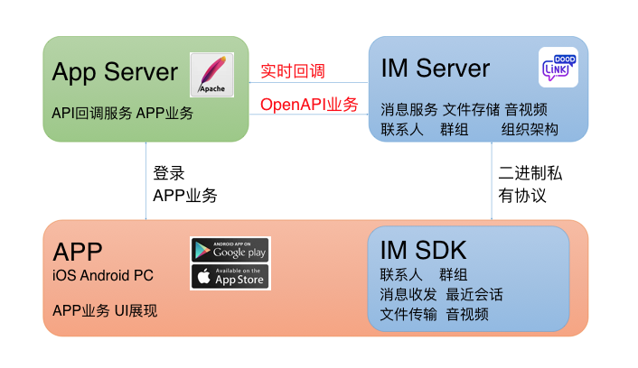
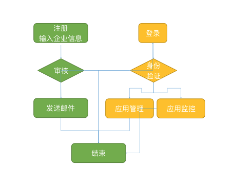
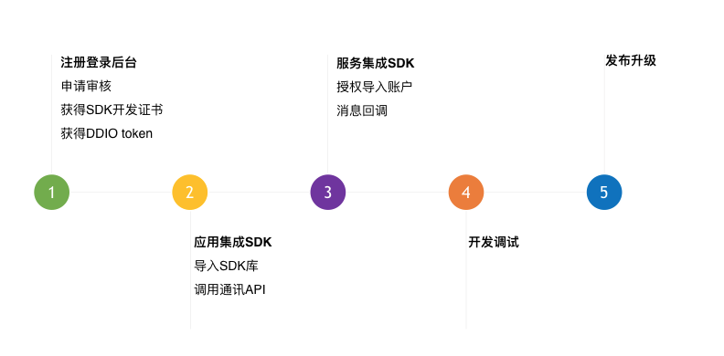
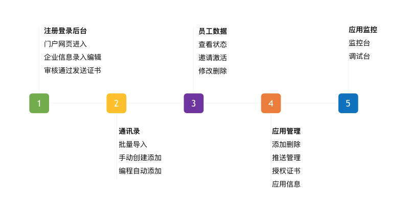

#LinkDood SDK开发指南

##功能概述
* LinkDood是北信源软件股份有限公司为移动应用提供的完善即时通讯开发框架，IM基础功能满足App用户需求的基本功能
* LinkDood SDK是。。。通过豆豆平台，开发者不必搭建服务端硬件环境，就可以将即时通讯、实时网络能力快速集成至应用中。
* 聊天方式：单聊、群聊、聊天室
* 信息类型：文字、表情、图片、语音、视频、地理位置、通知消息

##快速入门
###快速开始
* 开始集成豆豆SDK
* 加入豆豆，注册豆豆账号
* 在开发者后台创建App，获取token与授权证书
* 下载SDK，通过SDK连接到App服务器
* 发送消息，设置用户信息提供者
* 进行UI界面定义和功能调整
* 提交上线申请，应用市场上线

###架构介绍

###SDK注册审核流程

###SDK客户端接入流程

###SDK后台管理流程

##iOS客户端集成
请参考文档[《IM基础功能(iOS)开发指南》](iOS/describe.md)

##Android客户端集成
请参考文档[《IM基础功能(Android)开发指南》](Android/describe.md)

##PC端集成
请参考文档[《IM基础功能(PC)开发指南》]()

##服务端集成
请参考文档[《IM基础功能(服务端)开发指南》]()

 

    